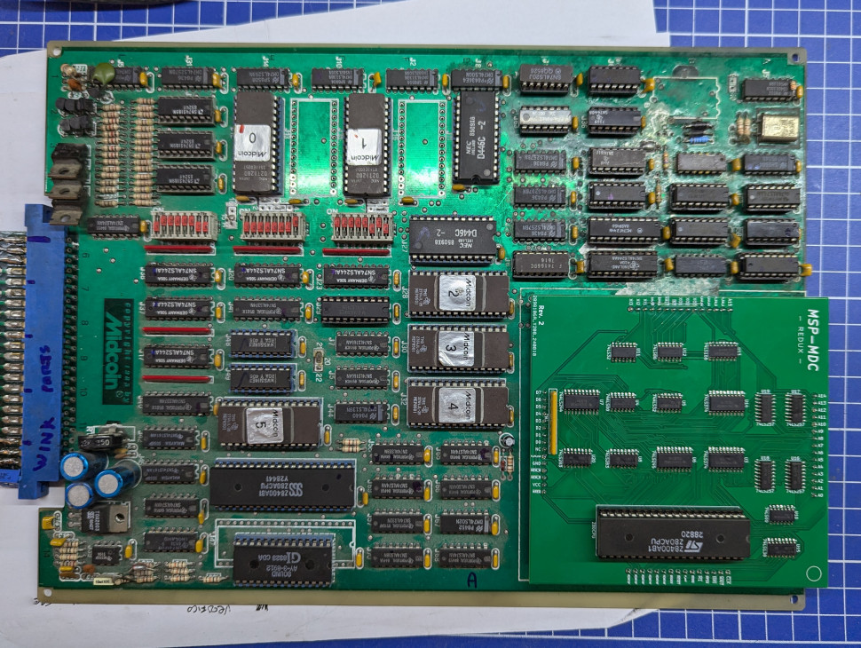

# MSP-MDC Redux

## DISCLAIMER

Any use of this project is **under your own responsibility**.
You will be responsible of checking the correct construction and functionality of your board.
By using this project You will agree that I cannot be held responsible if it will destroy any of your devices, damage your computer, burn down your house or whatever.

## Introduction

Wink is a 1985, breakout-style, arcade game by Midcoin.

The board uses off-the-shelf components for everything, but a bunch of circuitry, called the MSP-MDC module, that acts both as CPU and as 
security (scrambling addresses accessed by the CPU), is placed on 3 sandwiched sandwiched PCBs encased in epoxy.
This was made to thwart bootleggers, but. if something within this board dies, the whole game becomes useless.

I painstakingly pulled the boards apart and chipped away the epoxy to recover the board schematic.

This project contains files to build a compatible board that can be plugged in place of the original MSP-MDC.

## Hardware

The board was designed with [KiCad](https://kicad.org/) EDA.

You can order boards directly from [PCBWay](https://www.pcbway.com/project/shareproject/MSP_MDC_Redux_c4e8a048.html)!

### Bill of Materials

| Component         | Qty | Type / Value                   | Notes                                                    |
| ----------------- | --- | ------------------------------ | -------------------------------------------------------- |
| C1 - C14          | 19  | 100nF / 1206 / ceramic         |                                                          |
| R1, R2            |  2  | 1K / 1206                      |                                                          |
| RN1               |  1  | 9-pin bussed 10K resistor array|                                                          |
|                   |  4  | 4x15pin 2.54mm straight headers| Mount on the 4 sides of the module                       |
| U2                |  1  | DIP-40 Z80A CPU                | It's a good idea to socket this                          |
| U3, U14           |  2  | 74LS374 SO-20                  | 5.3x12.6mm                                               |
| U4                |  1  | 74ALS00 SOIC-14                | 3.9x8.7mm                                                |
| U5                |  1  | 74ALS32 SOIC-14                | 3.9x8.7mm                                                |
| U6                |  1  | 74LS245 SO-20                  | 5.3x12.6mm                                               |
| U7                |  1  | 74ALS244 SO-20                 | 5.3x12.6mm                                               |
| U8, U20           |  2  | 74LS283 SOIC-16                | 3.9x9.9mm                                                |
| U10               |  1  | 74LS00 SOIC-14                 | 3.9x8.7mm                                                |
| U11               |  1  | 74LS32 SOIC-14                 | 3.9x8.7mm                                                |
| U12               |  1  | 74LS86 SOIC-14                 | 3.9x8.7mm                                                |
| U13               |  1  | 74LS166 SOIC-16                | 3.9x9.9mm                                                |
| U15               |  1  | 74LS138 SOIC-16                | 3.9x9.9mm                                                |
| U16 - U19         |  4  | 74LS257 SOIC-16                | 3.9x9.9mm                                                |
